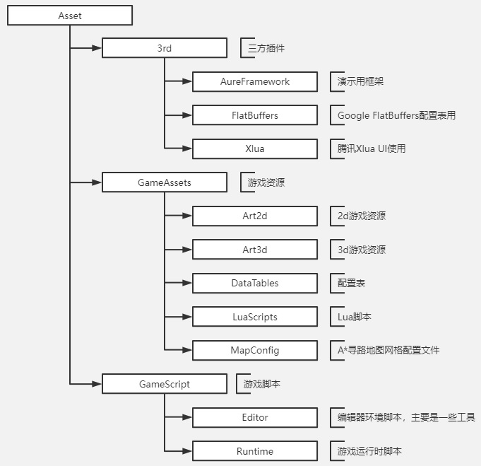

# BiuBiu 简介

BiuBiu是一个使用AureFramework框架制作的游戏演示项目，供使用AureFramework时参考。  
（目前只为学习分享使用）  

### Unity版本

* Unity 2020.3.15f1c1

# 引用

游戏项目里面使用了Unity Dots，所以引用了许多Unity的ECS相关的Package，已同步上传manifest.json文件，安装失败的可以根据文件中引用的包手动在Package Manager中安装。

# 框架

[AureFramework](https://gitee.com/yyyurz/Aure-Framework) Gitee国内较快  
[AureFramework](https://github.com/YYYurz/AureFramework) GitHub  

# 项目主要结构图

# 游戏内录屏

